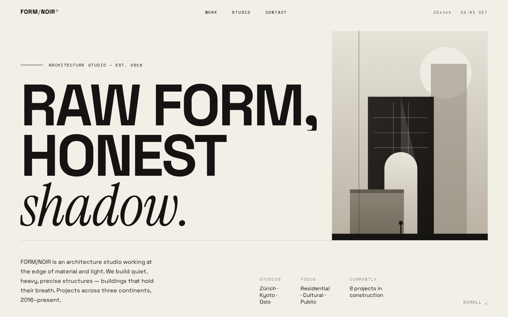
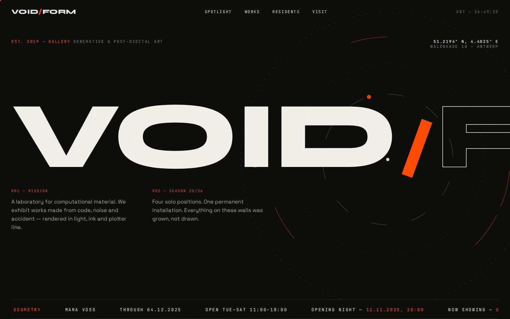
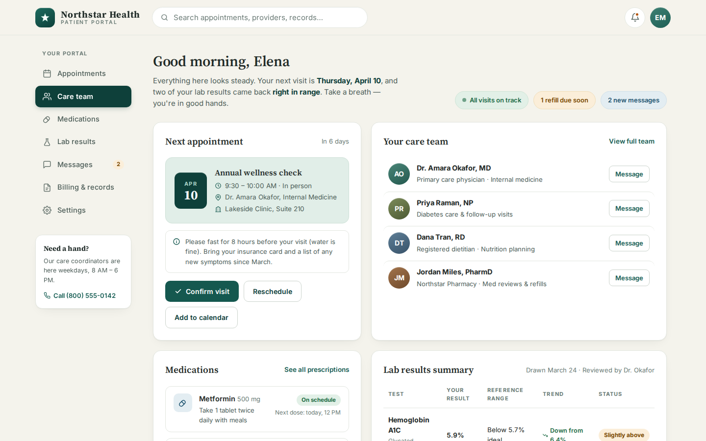
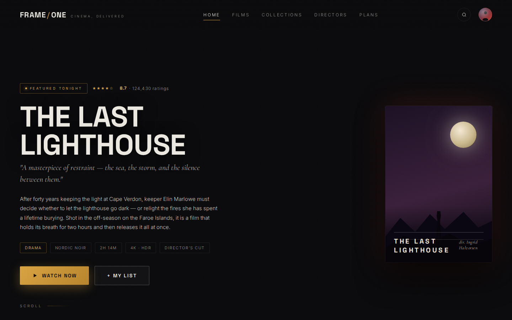

# Qwen3.8 Showcase

50 websites, one sample each, generated by Qwen 3.8 27B on a single RTX 3090.
Every card links to the original HTML page, so a demo can be opened directly or
shown in a clean presentation view. Three.js scenes are not part of this repo.

**[Open the live Qwen3.8 Showcase ↗](https://ajay9o9.github.io/Qwen3.8-showcase/)** — browse the generated websites, click any card to open the original page, or use the presentation view.

  
  
  
  

## Prompts

The one-shot prompts are in the git repo, not on the public gallery:

- [`PROMPTS.md`](PROMPTS.md) — readable
- [`prompts.json`](prompts.json) — machine-readable

Each generated page is a single sample from that user prompt plus the shared system prompt.

## What is included

The public gallery is a hand-picked subset of local Qwen 3.8 27B runs. Use
the picker to choose pages. Nothing is published unless it is listed in
catalog.json.

Model names and labels are presentation metadata. Source tags are retained in
the generated site/catalog.json for provenance, but raw runtime suffixes do
not appear in the gallery header.

## Pick pages by hand

The public site only includes pages listed in catalog.json. Do not use
`"tasks": "all"` — pick each page.

From this repository:

~~~bash
python3 tools/pick_showcase.py
~~~

Open http://127.0.0.1:8777/. Click screenshots to include or exclude them,
then **Save catalog** or **Save & export**. Export copies the checked HTML
and screenshots into site/ and regenerates site/catalog.json.

## Re-export from the benchmark checkout

From this repository:

~~~bash
python3 tools/export_showcase.py   --source-root /media/aj-homeserver/windows/krea2-model/qwen-3.8/compare   --catalog catalog.json   --output docs   --clean
~~~

Edit catalog.json in the picker (preferred) or by hand, then run export and
commit the generated site/ files. The exporter copies only selected HTML and
screenshots and validates paths before writing.

Preview locally:

~~~bash
python3 -m http.server 8000 --directory docs
~~~

Open http://127.0.0.1:8000/. Use the Present button for a minimal,
screenshot-friendly view with model tabs, a task sidebar, and the live preview.

## GitHub Pages

GitHub Actions needs a billing account. This repo uses the free **branch**
publish path instead: the live site is the `docs/` folder on `main`.

1. Push `main` (including `docs/`).
2. Repo **Settings → Pages**.
3. **Build and deployment → Source:** Deploy from a branch.
4. Branch: `main` / folder: `/docs`.
5. Save. After a minute the gallery is at
   `https://<user>.github.io/<repo>/`.

Do not select “GitHub Actions” as the Pages source unless billing is fixed.
